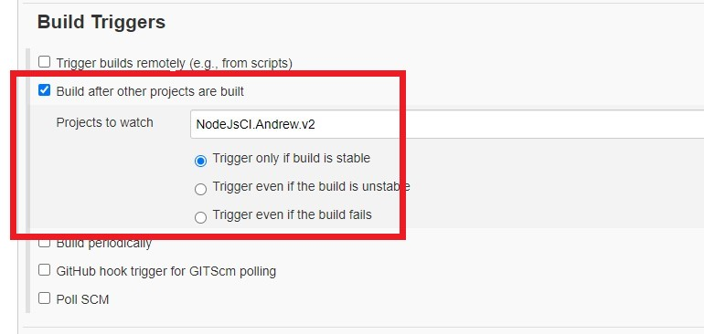

### removing the remote origin on the repository

    We want to remove the remote and add our own remote, thus we can point it to our own repository
    ```commandline
    git remote rm origin
    ```

    Now when we run ```git remote --v```, there shouldn't be any remote's

    We will now make a repo from which we will have this folder point to, after we have created the repo we run the following
    command
    ```commandline
    git@github.com:aosborne17/Node-App-Pipeline.git
    ```

    or for http we could run
    ```commandline
    git remote set-url origin https://github.com/aosborne17/Node-App-Pipeline.git
    ```

    We can now push to github
    ```commandline
    git push -u orgin master
    ```

### Continuous Integration With Jenkins

- The first Jenkins job will listen to any pushes that are made to a dev branch on our github repository, this is made
possible due to the addition of webhooks that will constantly listen to any requests

- Once a push has been made, the Continuous integration job will try to build the code, test it and providing this passes, the
code will be will merged into the master branch


### Continuous Delivery With Jenkins

- The second Jenkins will only run providing the first has built successfully, this was done by adding this configuration



- We need to open port 22 for jenkins


Inside the execute shell we add the following commands to 

```commandline
# '-r' stands for recursive, this tells scp to recursively copy the source directory and its contents
scp -o "StrictHostKeyChecking=no" -r app ubuntu@54.247.55.44:/home/ubuntu
scp -o "StrictHostKeyChecking=no" -r environment ubuntu@54.247.55.44:/home/ubuntu
ssh -o "StrictHostKeyChecking=no" ubuntu@54.247.55.44 <<EOF	
    sudo bash ./environment/app/provision.sh
    cd app
    pm2 kill
    pm2 start app.js
    
EOF
```

After this must then add a ssh port 22 connection, we are using 0,0,0,0 because this means we are allowing everyone in,
including the jenkins folder that we are working with


For this configuration the '*' works as a placeholder, this means that as long as the branch starts with 'dev' then it
will listen to these branches

